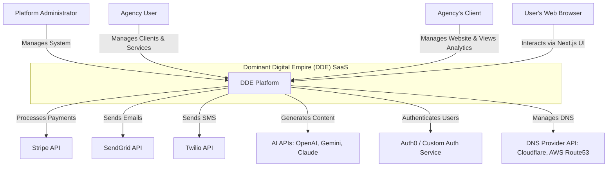
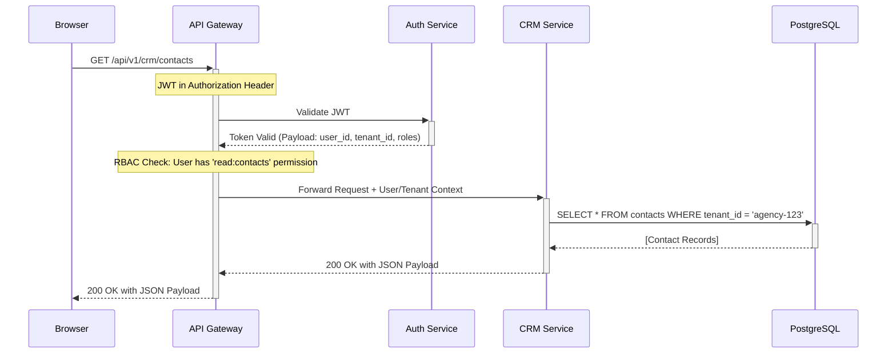
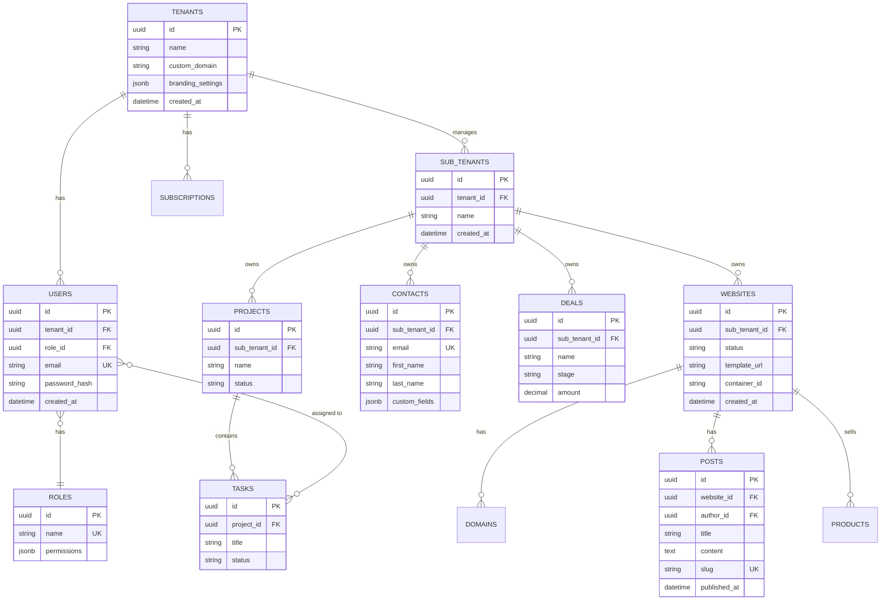

Of course. As a Senior Full-Stack & Cloud Architect, I will now produce the Phase 2 Technical Architecture Specification for the "Dominant Digital Empire" (DDE) platform. This document provides a comprehensive blueprint for the engineering team to begin development.

***

# Technical Architecture Specification: Dominant Digital Empire (DDE)

| **Document Version** | **Date**       | **Author**                                 | **Status**      |
| -------------------- | -------------- | ------------------------------------------ | --------------- |
| 2.0                  | October 26, 2023 | AI Senior Full-Stack & Cloud Architect | Final for Review |

## Table of Contents

1.  **System Architecture**
    1.1. High-Level Architecture Description
    1.2. C4 Model: System Context & Container Diagram
    1.3. Component Breakdown & Modular Service Layout
    1.4. Data Flow Diagram: New Client Onboarding & Website Deployment
    1.5. Sequence Diagram: Authenticated API Request

2.  **Database Design**
    2.1. Multitenancy Strategy: Row-Level Security (RLS)
    2.2. Entity-Relationship Diagram (ERD)
    2.3. Core Table Definitions
    2.4. Indexing Strategy
    2.5. Data Lifecycle & Backup Strategy

3.  **API Specification**
    3.1. Design Principles & Gateway
    3.2. Authentication & Authorization (RBAC)
    3.3. Core Endpoint Definitions (Examples)
    3.4. Rate Limiting & Throttling
    3.5. Error Handling & Standard Response Format

4.  **Integration Architecture**
    4.1. External API Integrations
    4.2. Webhook Strategy (Ingress & Egress)

***

## 1. System Architecture

### 1.1. High-Level Architecture Description

The Dominant Digital Empire (DDE) platform is designed as a **modular, API-first, multi-tenant system**. The architecture prioritizes separation of concerns, scalability, and security. The backend will be built as a set of logically separated services (a "modular monolith" to start, with clear boundaries for future microservice extraction) using FastAPI. The frontend is a decoupled Next.js application.

All client-facing websites are provisioned into isolated Docker containers, managed by a dedicated **Provisioning Service**, ensuring resource and security isolation. Communication between services will be facilitated via a combination of direct API calls through an API Gateway and asynchronous events using a Redis-based message bus for long-running tasks like website deployment or AI content generation.

### 1.2. C4 Model: System Context & Container Diagram

#### System Context (Level 1)



#### Container Diagram (Level 2)

```mermaid
graph TD
    subgraph "User's Device"
        WebApp[Next.js Single-Page Application]
    end

    subgraph "DDE Cloud Infrastructure (AWS/GCP/Azure)"
        APIGateway[API Gateway <br/><i>(e.g., Kong, Traefik)</i><br/>Auth, Rate Limiting, Routing]

        subgraph "DDE Core Services (FastAPI)"
            AuthService[Auth Service <br/><i>Login, JWT, RBAC</i>]
            TenantService[Tenant & Billing Service <br/><i>Manages Agencies, Clients, Subscriptions</i>]
            CRMService[CRM Service <br/><i>Contacts, Deals, Pipelines</i>]
            CMSService[CMS & AI Content Service <br/><i>Blogs, Pages, AI Generation</i>]
            ProjectService[Project Management Service <br/><i>Projects, Tasks, Kanban</i>]
            ProvisioningService[Website Provisioning Service <br/><i>Controls Docker/K8s for Client Sites</i>]
        end

        subgraph "Data & Infrastructure Tier"
            PostgresDB[(PostgreSQL DB <br/><i>Primary Datastore</i>)]
            Redis[(Redis <br/><i>Cache, Job Queue, Event Bus</i>)]
            S3[(S3 Object Storage <br/><i>Digital Assets, Backups</i>)]
            Monitoring[Monitoring Stack <br/><i>(Prometheus, Grafana)</i>]
        end

        subgraph "Client Website Hosting Environment"
            DockerHost[Docker Host / Kubernetes Cluster]
            DockerHost --> C1[Container 1: Client A Website <br/><i>Nginx + FastAPI/PHP</i>]
            DockerHost --> C2[Container 2: Client B Website <br/><i>Nginx + FastAPI/PHP</i>]
            DockerHost --> C3[Container ...n]
        end

        APIGateway --> AuthService
        APIGateway --> TenantService
        APIGateway --> CRMService
        APIGateway --> CMSService
        APIGateway --> ProjectService

        TenantService --> Stripe[Stripe API]
        CMSService --> LLM_APIs[AI APIs]
        ProvisioningService --> DockerHost
        ProvisioningService --> DNSProvider[DNS Provider API]

        AuthService --> PostgresDB
        TenantService --> PostgresDB
        CRMService --> PostgresDB
        CMSService --> PostgresDB
        ProjectService --> PostgresDB
        CMSService --> S3
        ProjectService --> S3

        %% Event Bus
        ProvisioningService -.->|Publishes Events| Redis
        CMSService -.->|Publishes Events| Redis
        TenantService -.->|Subscribes to Events| Redis
    end

    WebApp --> APIGateway
```

### 1.3. Component Breakdown & Modular Service Layout

| Service Name                 | Responsibilities                                                                                                                              | Key Technologies  |
| ---------------------------- | --------------------------------------------------------------------------------------------------------------------------------------------- | ----------------- |
| **Frontend (Next.js)**       | Renders Admin, Agency, and Client dashboards. Website builder UI. Consumes the backend API.                                                   | Next.js, Tailwind |
| **API Gateway**              | Single entry point for all API requests. Handles SSL termination, authentication, rate limiting, and routing to appropriate backend services. | Kong / Traefik    |
| **Auth Service**             | User registration, login, JWT generation/validation, password management, 2FA, and RBAC enforcement.                                          | FastAPI, OAuth2   |
| **Tenant & Billing Service** | Manages `tenants` (Agencies) and `sub_tenants` (Clients). Handles Stripe subscription logic, invoicing, and white-labeling settings.           | FastAPI, Stripe SDK |
| **CRM Service**              | Manages contacts, companies, deals, pipelines, and marketing automation workflows. Integrates with Twilio/SendGrid.                           | FastAPI           |
| **CMS & AI Content Service** | Manages website pages, blog posts, templates, and digital assets (via S3). Orchestrates calls to external AI APIs for content generation.      | FastAPI, LLM SDKs |
| **Project Management Service** | Manages projects, tasks, sprints, and team collaboration features.                                                                           | FastAPI           |
| **Website Provisioning Service** | **[CRITICAL]** The "MSP OS" core. Listens for events (e.g., `client.created`). Provisions/decommissions Docker containers, configures Nginx, sets up SSL, runs Git deployments, and manages backups. | FastAPI, Docker SDK |
| **PostgreSQL Database**      | Primary relational data store for all services.                                                                                               | PostgreSQL 16     |
| **Redis**                    | Used as a high-speed cache, a message broker for inter-service communication (Pub/Sub), and a job queue (Celery/ARQ).                          | Redis 7           |
| **S3 Object Storage**        | Stores all user-generated content: images for websites, project file uploads, digital assets, and database backups.                           | MinIO / AWS S3    |

### 1.4. Data Flow Diagram: New Client Onboarding & Website Deployment

1.  **Agency User** logs into the DDE platform and navigates to "Add New Client".
2.  **Frontend (Next.js)** displays a form for client details (name, domain, website template, features to enable).
3.  Agency submits the form. Frontend sends a `POST /api/v1/clients` request to the **API Gateway**.
4.  **API Gateway** authenticates the request (valid JWT) and routes it to the **Tenant & Billing Service**.
5.  **Tenant & Billing Service** validates the data, checks the Agency's subscription plan for client limits, and creates a new `sub_tenants` record in the **PostgreSQL DB**.
6.  Upon successful creation, the service publishes a `client.website.provision_requested` event to the **Redis Event Bus**. The event payload includes `sub_tenant_id`, `domain`, `template_git_url`, etc.
7.  The **Website Provisioning Service**, a subscriber to this event, picks up the job.
8.  **Provisioning Service** executes the following sequence:
    a.  Calls the **Docker Host/Kubernetes API** to create a new, isolated container from a base image (Nginx + FastAPI).
    b.  Clones the selected website template from a Git repository into the container's volume.
    c.  Generates Nginx configuration for the client's domain and reloads Nginx.
    d.  Calls a DNS Provider API (e.g., Cloudflare) to create an A record for the client's domain pointing to the server's IP.
    e.  Initiates an SSL certificate request (e.g., via Let's Encrypt).
9.  Once provisioning is complete, the **Provisioning Service** updates the `websites` table in **PostgreSQL** with the status (`live`) and IP address.
10. It then publishes a `client.website.provision_success` event to **Redis**.
11. The **Tenant & Billing Service** (or a dedicated notification service) listens for this event and triggers an email (via **SendGrid**) to the Agency and/or Client with their new website details and login credentials.

### 1.5. Sequence Diagram: Authenticated API Request



---

## 2. Database Design

### 2.1. Multitenancy Strategy: Row-Level Security (RLS)

We will use a **Shared Database, Shared Schema** approach. Every table that contains tenant-specific data will have a `tenant_id` column (for the Agency) and, where applicable, a `sub_tenant_id` column (for the Agency's Client).

-   **Enforcement**: All database queries will be forced to include a `WHERE tenant_id = ?` clause. This will be enforced at the application layer via a FastAPI dependency that injects the `tenant_id` from the validated JWT into every repository/database call. This prevents data leakage between tenants.
-   **Scalability**: This model is cost-effective and scales well for thousands of tenants. For enterprise-level tenants requiring higher isolation, a "database per tenant" model can be offered as a premium feature in the future.

### 2.2. Entity-Relationship Diagram (ERD)



### 2.3. Core Table Definitions

```sql
-- Represents an Agency
CREATE TABLE tenants (
    id UUID PRIMARY KEY DEFAULT gen_random_uuid(),
    name VARCHAR(255) NOT NULL,
    owner_id UUID REFERENCES users(id), -- Initial user who created the tenant
    stripe_customer_id VARCHAR(255) UNIQUE,
    created_at TIMESTAMPTZ NOT NULL DEFAULT NOW()
);

-- Represents an Agency's Client
CREATE TABLE sub_tenants (
    id UUID PRIMARY KEY DEFAULT gen_random_uuid(),
    tenant_id UUID NOT NULL REFERENCES tenants(id) ON DELETE CASCADE,
    name VARCHAR(255) NOT NULL,
    created_at TIMESTAMPTZ NOT NULL DEFAULT NOW()
);

-- Users can be Agency members or invited Client members
CREATE TABLE users (
    id UUID PRIMARY KEY DEFAULT gen_random_uuid(),
    tenant_id UUID NOT NULL REFERENCES tenants(id) ON DELETE CASCADE,
    email VARCHAR(255) NOT NULL UNIQUE,
    password_hash VARCHAR(255) NOT NULL,
    role VARCHAR(50) NOT NULL DEFAULT 'client', -- e.g., 'admin', 'agency', 'client'
    created_at TIMESTAMPTZ NOT NULL DEFAULT NOW()
);

-- Each client's provisioned website instance
CREATE TABLE websites (
    id UUID PRIMARY KEY DEFAULT gen_random_uuid(),
    sub_tenant_id UUID NOT NULL REFERENCES sub_tenants(id) ON DELETE CASCADE,
    primary_domain VARCHAR(255) UNIQUE,
    status VARCHAR(50) NOT NULL DEFAULT 'provisioning', -- provisioning, live, suspended, error
    container_id VARCHAR(255),
    template_git_url VARCHAR(512),
    created_at TIMESTAMPTZ NOT NULL DEFAULT NOW()
);
-- NOTE: All other tables (contacts, posts, projects, etc.) will have a `sub_tenant_id` and `tenant_id` FK.
```

### 2.4. Indexing Strategy

-   **Primary/Foreign Keys**: All primary and foreign keys will be indexed by default.
-   **Composite Indexes for Multitenancy**: For high-traffic tables, composite indexes will be created to optimize queries within a tenant's data scope. This is the most critical performance optimization.
    -   `CREATE INDEX idx_contacts_tenant_email ON contacts (tenant_id, email);`
    -   `CREATE INDEX idx_posts_website_status ON posts (website_id, status);`
-   **Indexes for Common Filters**: Indexes will be added to columns frequently used in `WHERE` clauses, `JOIN` conditions, and `ORDER BY` clauses (e.g., `status`, `created_at`, `slug`).

### 2.5. Data Lifecycle & Backup Strategy

-   **Backups**: PostgreSQL will be configured for Point-in-Time Recovery (PITR). Daily snapshots will be taken and stored securely in S3 Object Storage with a retention policy of 30 days.
-   **Soft Deletes**: Critical records (like `sub_tenants` or `websites`) will use a soft-delete pattern (`deleted_at TIMESTAMPTZ NULL`) to allow for recovery.
-   **Data Archival**: A cron job will run periodically to archive old, inactive data (e.g., analytics logs older than 1 year) from PostgreSQL to a cheaper storage solution like S3 Glacier.

---

## 3. API Specification

### 3.1. Design Principles & Gateway

-   **Protocol**: RESTful principles over HTTP/S.
-   **Data Format**: JSON for all requests and responses.
-   **Versioning**: API will be versioned in the URL: `/api/v1/...`.
-   **Gateway**: An API Gateway (Kong/Traefik) will be the single entry point. It will manage request routing to the appropriate FastAPI service based on the path.

### 3.2. Authentication & Authorization (RBAC)

-   **Authentication**: Stateless authentication using JSON Web Tokens (JWT). The `Auth Service` will issue short-lived access tokens and long-lived refresh tokens upon successful login.
-   **JWT Payload**: The JWT payload will contain `user_id`, `tenant_id`, `sub_tenant_id` (if applicable), and an array of `roles`/`permissions`.
-   **Authorization (RBAC)**: A custom FastAPI dependency will inspect the JWT on every protected endpoint. It will verify that the user's role/permissions grant access to the requested resource and scope.
    -   **Admin**: Full system access.
    -   **Agency**: Full access to their own `tenant_id` data and all associated `sub_tenants`.
    -   **Client**: Restricted access to data only within their own `sub_tenant_id`.

### 3.3. Core Endpoint Definitions (Examples)

| Endpoint                               | Method | Description                                       | Required Role |
| -------------------------------------- | ------ | ------------------------------------------------- | ------------- |
| `POST /api/v1/auth/login`              | POST   | Authenticate a user and return JWTs.              | Public        |
| `POST /api/v1/tenants/clients`         | POST   | Agency creates a new client (sub-tenant).         | Agency        |
| `GET /api/v1/tenants/clients`          | GET    | List all clients for the authenticated agency.    | Agency        |
| `GET /api/v1/clients/{clientId}/website` | GET    | Get website details for a specific client.        | Agency, Client |
| `POST /api/v1/clients/{clientId}/website/deploy` | POST | Trigger a new deployment from a Git branch. | Agency, Client |
| `GET /api/v1/crm/contacts`             | GET    | Get a paginated list of contacts for a client.    | Agency, Client |
| `POST /api/v1/cms/posts`               | POST   | Create a new blog post for the client's website.  | Agency, Client |

**Example Request/Response:** `POST /api/v1/tenants/clients`

*   **Request Body:**
    ```json
    {
      "clientName": "New Retail Co",
      "website": {
        "domain": "newretail.com",
        "template": "ecommerce-pro",
        "features": ["blog", "estore", "chatbot"]
      }
    }
    ```
*   **Success Response (201):**
    ```json
    {
      "id": "sub-tenant-uuid-456",
      "name": "New Retail Co",
      "status": "provisioning",
      "websiteId": "website-uuid-789",
      "createdAt": "2023-10-26T10:00:00Z"
    }
    ```

### 3.4. Rate Limiting & Throttling

-   Rate limiting will be implemented at the **API Gateway** level using a token bucket algorithm, backed by Redis.
-   Limits will be tiered based on the Agency's subscription plan (e.g., Basic: 100 RPM, Pro: 500 RPM, Enterprise: 2000 RPM).
-   Specific, computationally expensive endpoints (like AI generation) will have stricter, independent rate limits.

### 3.5. Error Handling & Standard Response Format

All API errors will return a standardized JSON object.

*   **Standard Error Response:**
    ```json
    {
      "error": {
        "code": "resource_not_found",
        "message": "Client with ID '123' not found for this tenant.",
        "statusCode": 404
      }
    }
    ```
*   **Common HTTP Status Codes:**
    -   `200 OK`: Request successful.
    -   `201 Created`: Resource created successfully.
    -   `204 No Content`: Request successful, no body returned.
    -   `400 Bad Request`: Invalid syntax or validation error.
    -   `401 Unauthorized`: Missing or invalid authentication token.
    -   `403 Forbidden`: Authenticated but not authorized to perform the action.
    -   `404 Not Found`: The requested resource does not exist.
    -   `500 Internal Server Error`: A generic server-side error occurred.

---

## 4. Integration Architecture

### 4.1. External API Integrations

All external API keys and secrets will be stored in a secure vault (e.g., HashiCorp Vault, AWS Secrets Manager) and injected into services as environment variables, never hardcoded.

| Service       | Purpose                               | Integration Pattern                                                                                                                              |
| ------------- | ------------------------------------- | ------------------------------------------------------------------------------------------------------------------------------------------------ |
| **Stripe**    | Subscription Billing, Invoicing       | Server-side integration using the official Stripe Python SDK in the **Tenant & Billing Service**. Uses Stripe Webhooks to handle payment events. |
| **SendGrid**  | Transactional & Marketing Emails      | Server-side integration via Python SDK in the **CRM Service** and other services for notifications.                                              |
| **Twilio**    | SMS Marketing & Notifications         | Server-side integration via Python SDK in the **CRM Service**.                                                                                   |
| **AI APIs**   | Content Generation (GPT, Claude, etc.)| Server-side integration via SDKs in the **CMS & AI Content Service**. An abstraction layer will be built to allow switching between providers.    |
| **Auth0**     | (Optional) SSO & Social Logins        | Standard OAuth2/OIDC flow. Can be used as an alternative or supplement to the custom **Auth Service**.                                           |
| **Cloudflare**| DNS & SSL Management                  | Server-side integration via API in the **Website Provisioning Service** to programmatically create DNS records and manage SSL certificates.        |

### 4.2. Webhook Strategy

-   **Ingress (Consuming Webhooks)**:
    -   A dedicated, isolated endpoint (`/api/v1/webhooks/{service}`) will be created to receive webhooks (e.g., from Stripe).
    -   The webhook handler will perform signature verification immediately.
    -   It will then place the validated payload onto a **Redis job queue** for asynchronous processing by the relevant service. This ensures the webhook endpoint responds quickly (200 OK) and prevents data loss if the processing service is temporarily down.
-   **Egress (Producing Webhooks)**:
    -   The platform will support user-configurable webhooks (e.g., "notify this URL when a new contact is created").
    -   When an event occurs, a job will be dispatched to a dedicated queue.
    -   A worker will process this queue, making outbound HTTP POST requests to the user-configured URLs with a JSON payload. It will include retry logic with exponential backoff for failed deliveries.