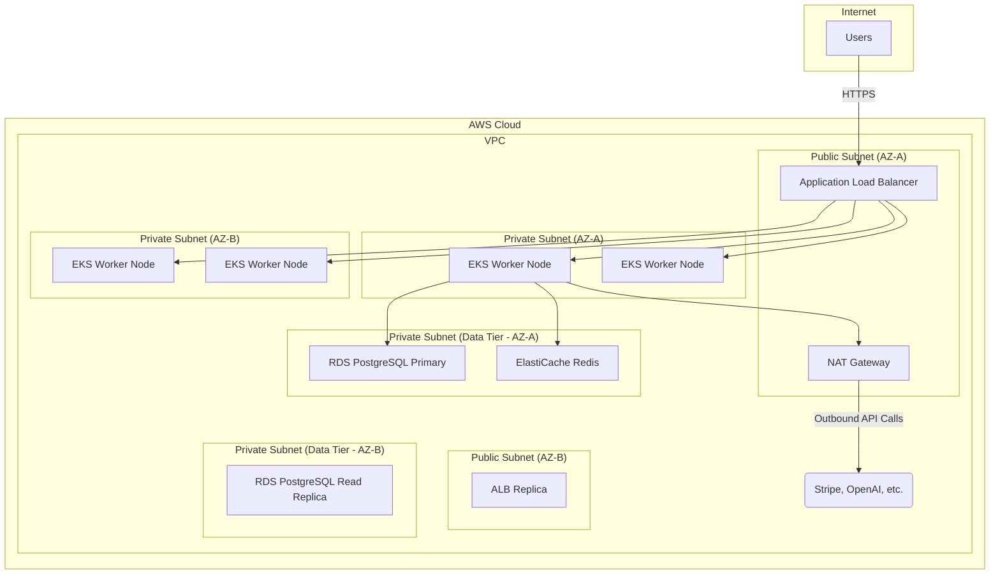

Of course. As a Senior DevOps Architect, I will now generate the complete Phase 3 Deployment and Infrastructure Architecture for the "Dominant Digital Empire" (DDE) platform. This document provides a production-grade blueprint for deploying, scaling, and securing the DDE ecosystem.

---

### **Project:** Dominant Digital Empire (DDE)
### **Phase 3:** Deployment & Infrastructure Architecture
### **Document Version:** 1.0
### **Author:** Senior DevOps Architect

## **Introduction**

This document outlines the comprehensive infrastructure, deployment, security, and operational architecture for the Dominant Digital Empire (DDE) SaaS platform. The design prioritizes scalability, security, resilience, and automation to support a multi-tenant environment serving a growing number of digital agencies and their clients.

The architecture is presented in two primary deployment models:
1.  **Single VPS (Docker Compose):** A streamlined setup for small-scale deployments, development, and initial launch.
2.  **Scalable Cloud Cluster (Kubernetes):** A robust, auto-scaling architecture for production environments handling significant load, built on a major cloud provider (e.g., AWS, GCP, Azure).

---

## 1. Hosting & Infrastructure Design

### 1.1. Environment Strategy

A three-tiered environment strategy ensures stability and quality control:

| Environment | Purpose                                                              | Infrastructure Model                                       | Data Policy                                    |
| :---------- | :------------------------------------------------------------------- | :--------------------------------------------------------- | :--------------------------------------------- |
| **`dev`**   | Local developer machines.                                            | Docker Compose (`docker-compose.dev.yml`)                  | Seeded with mock/anonymized data.              |
| **`staging`** | Pre-production environment for UAT, integration testing, and demos.  | Kubernetes (scaled-down replica of production).            | Anonymized, recent snapshot of production data. |
| **`prod`**  | Live environment for all customer-facing services.                   | Kubernetes (auto-scaling, multi-AZ, highly available).     | Live customer data.                            |

### 1.2. Network Topology (Production - Kubernetes on AWS Example)

*   **VPC:** A dedicated Virtual Private Cloud (VPC) will isolate the DDE network.
*   **Subnets:**
    *   **Public Subnets (x2-3):** Deployed across multiple Availability Zones (AZs) for high availability. Will host the Application Load Balancer (ALB) / Ingress Controller and Bastion Hosts.
    *   **Private Subnets (x2-3):** Also across multiple AZs. Will host the Kubernetes worker nodes (EKS), databases (RDS), and cache (ElastiCache). Nodes in private subnets do not have public IPs.
*   **NAT Gateway:** Placed in a public subnet to allow outbound internet access from services in private subnets (e.g., for calling third-party APIs like Stripe, OpenAI).
*   **Internet Gateway:** Attached to the VPC to allow inbound traffic from the internet to the public subnets.
*   **Security Groups & NACLs:** Granular firewall rules will be applied at the instance and subnet level to enforce the principle of least privilege. For example, only the application pods can connect to the database security group on the designated PostgreSQL port.



### 1.3. Scaling Approach

*   **Horizontal Pod Autoscaling (HPA):** Kubernetes will automatically scale the number of pods for each microservice based on CPU and memory utilization.
*   **Cluster Autoscaling:** The Kubernetes cluster itself will automatically add or remove worker nodes based on overall resource demand.
*   **Database Scaling:** Utilize managed PostgreSQL (e.g., AWS RDS) with read replicas to offload read traffic and scale vertically by upgrading instance sizes as needed.
*   **Stateless Services:** All backend FastAPI services will be designed as stateless, allowing for seamless horizontal scaling. State will be managed in PostgreSQL, Redis, and S3.

### 1.4. Load Balancer, CDN, and Caching Strategy

*   **Load Balancer:** An Application Load Balancer (AWS ALB) managed by the Kubernetes Ingress Controller (e.g., AWS Load Balancer Controller) will handle traffic distribution, SSL termination, and routing to the appropriate services.
*   **CDN (Content Delivery Network):** A CDN like AWS CloudFront or Cloudflare will be used to serve all static assets (JS, CSS, images from the Next.js frontend) and user-uploaded content from the S3 bucket. This reduces latency for global users and offloads traffic from the application servers.
*   **Caching:**
    *   **CDN Cache:** For static assets.
    *   **Redis (ElastiCache):** Used for application-level caching (e.g., frequently accessed data, session storage), as a message broker for the event bus, and for managing job queues.
    *   **Database Cache:** The managed PostgreSQL instance will have its own in-memory cache.

### 1.5. Logging, Monitoring, and Observability (The "PLG" Stack)

*   **Logging:** All services will log structured JSON to `stdout`. A log aggregator like **Fluentd** or **Vector** will collect logs from all containers and forward them to **Loki**. Loki provides an efficient, queryable log storage system.
*   **Metrics:** **Prometheus** will be deployed in the cluster to scrape metrics from all services. FastAPI applications will expose metrics using a Prometheus client library. Node Exporter and kube-state-metrics will provide infrastructure-level metrics.
*   **Visualization & Alerting:** **Grafana** will be the central dashboard for visualizing logs from Loki and metrics from Prometheus. **Alertmanager** (part of the Prometheus ecosystem) will handle alerts, sending notifications to Slack, PagerDuty, or email based on predefined rules.

---

## 2. CI/CD Pipeline Design (using GitHub Actions)

The pipeline automates the entire lifecycle from code commit to production deployment.

**Workflow Trigger:** Push to `main` (for prod) or `develop` (for staging), or Pull Request to these branches.

```mermaid
graph TD
    A[Developer Pushes Code] --> B{GitHub Actions Workflow Triggered};
    B --> C[Setup Environment & Install Dependencies];
    C --> D{Run Linting & Static Analysis};
    D --> E{Run Unit & Integration Tests (PyTest)};
    E --> F{Security Scan (Snyk / Trivy)};
    F --> G{Build Docker Images};
    G --> H{Push Images to Container Registry (e.g., AWS ECR)};
    H --> I{Run E2E Tests (Playwright against Staging)};
    I --> J{Manual Approval Gate for Production};
    J --> K{Deploy to Production (Kubernetes)};
    K --> L[Monitor Deployment Health];

    subgraph "Testing & Building"
        C; D; E; F; G; H;
    end

    subgraph "Deployment"
        I; J; K; L;
    end
```

**Key Stages in `.github/workflows/deploy.yml`:**

1.  **Checkout & Setup:** Check out the code and set up Python/Node.js environments.
2.  **Lint & Test:** Run linters (e.g., Ruff, ESLint) and automated tests (`pytest`, `jest`). A failed test stops the pipeline.
3.  **Security Scans:**
    *   **SAST (Static Application Security Testing):** Scan code for vulnerabilities.
    *   **Container Scan:** Scan the built Docker image for known OS/library vulnerabilities using Trivy.
4.  **Build & Push:** Build Docker images for each service, tag them with the Git commit SHA, and push them to a private container registry (e.g., AWS ECR).
5.  **Deploy to Staging:** Automatically deploy the new images to the `staging` Kubernetes cluster using `kubectl` with Kustomize or a Helm chart.
6.  **End-to-End Testing:** Run Playwright tests against the `staging` environment to verify key user flows.
7.  **Manual Approval:** (For production deployments) A manual approval step in GitHub Actions ensures a final human check before releasing to production.
8.  **Deploy to Production:** Upon approval, the same deployment process is run against the `prod` cluster, using a rolling update strategy to ensure zero downtime.
9.  **Health Checks:** After deployment, the pipeline runs smoke tests against the production environment to confirm the new version is healthy.

---

## 3. Security Architecture

### 3.1. Authentication & Authorization

*   **Auth Service:** A dedicated microservice will handle user authentication using JWTs with short-lived access tokens and long-lived refresh tokens.
*   **RBAC:** A robust Role-Based Access Control system will be enforced at the API Gateway and within each microservice. Roles: `Platform Admin`, `Agency Admin`, `Agency User`, `Client Admin`, `Client User`.
*   **Tenant Isolation:** All database queries MUST be scoped by `tenant_id` and `sub_tenant_id` (client_id). Row-Level Security (RLS) in PostgreSQL will be implemented as a secondary defense layer to prevent data leakage between tenants.
*   **2FA:** Multi-Factor Authentication will be mandatory for all platform and agency admin accounts.

### 3.2. Data Encryption

*   **In Transit:** All communication will be encrypted using TLS 1.2/1.3. The load balancer will terminate SSL, and intra-cluster communication can also be encrypted using a service mesh like Linkerd or Istio.
*   **At Rest:**
    *   **Database:** Managed databases (RDS) will have encryption at rest enabled.
    *   **Object Storage (S3):** Server-side encryption (SSE-S3 or SSE-KMS) will be enabled by default for all buckets.
    *   **Secrets:** All secrets will be encrypted in the secrets management store.

### 3.3. Secrets Management

Application secrets (API keys, database passwords, JWT secrets) will NOT be stored in Git.
*   **Recommended:** HashiCorp Vault or a cloud provider's native solution (AWS Secrets Manager, GCP Secret Manager).
*   **Mechanism:** The application pods will be granted IAM roles (e.g., via IRSA on EKS) that allow them to fetch secrets from the secret store at runtime.

### 3.4. Platform Hardening

*   **Minimal Base Images:** Use minimal, hardened Docker base images (e.g., `distroless` or `alpine`).
*   **Read-only Filesystems:** Container filesystems will be mounted as read-only where possible.
*   **Network Policies:** Kubernetes NetworkPolicies will be used to restrict pod-to-pod communication, enforcing a zero-trust network model within the cluster.
*   **WAF (Web Application Firewall):** A WAF (e.g., AWS WAF) will be placed in front of the load balancer to protect against common web exploits like SQL injection and XSS.

### 3.5. Compliance Checklists (SOC2/GDPR-Ready)

*   **Audit Logging:** A dedicated service will record all sensitive actions (logins, data exports, permission changes) performed by users and admins.
*   **Data Portability:** Implement features for users to export their data in a machine-readable format (GDPR).
*   **Right to be Forgotten:** Create automated workflows to handle data deletion requests (GDPR).
*   **Vendor Management:** All third-party services (Stripe, Twilio, etc.) will be vetted for their own compliance certifications.

---

## 4. Deployment Blueprint

### 4.1. Option A: Single VPS with Docker Compose

This is ideal for smaller setups.

**`docker-compose.yml` Structure:**

```yaml
version: '3.8'

services:
  # -- NETWORKING --
  proxy:
    image: traefik:v2.10
    command:
      # ... Traefik configuration for Docker, Let's Encrypt
    ports:
      - "80:80"
      - "443:443"
    volumes:
      - /var/run/docker.sock:/var/run/docker.sock:ro
      - traefik-ssl-certs:/letsencrypt
    networks:
      - dde-network

  # -- DATABASE & CACHE --
  db:
    image: postgres:15-alpine
    volumes:
      - postgres_data:/var/lib/postgresql/data
    environment:
      - POSTGRES_DB=${POSTGRES_DB}
      # ... other PG env vars
    networks:
      - dde-network

  redis:
    image: redis:7-alpine
    networks:
      - dde-network

  # -- BACKEND SERVICES --
  api_gateway:
    build: ./services/gateway
    env_file: .env
    depends_on: [db, redis]
    networks: [dde-network]
    labels:
      # ... Traefik labels for routing
      - "traefik.http.routers.gateway.rule=Host(`${API_DOMAIN}`)"

  # ... Define other FastAPI services (auth, crm, cms, etc.) similarly ...

  # -- FRONTEND --
  frontend:
    build: ./frontend
    env_file: .env
    networks: [dde-network]
    labels:
      # ... Traefik labels for routing
      - "traefik.http.routers.frontend.rule=Host(`${APP_DOMAIN}`)"

volumes:
  postgres_data:
  traefik-ssl-certs:

networks:
  dde-network:
    driver: bridge
```

### 4.2. Option B: Kubernetes Cluster

This is the production-grade approach. The structure would be a set of YAML manifests, ideally managed by Helm.

**File Structure Example (`/k8s`):**

```
/k8s
├── charts/
│   ├── dde-platform/      # Main Helm chart
│   │   ├── Chart.yaml
│   │   ├── values.yaml
│   │   ├── templates/
│   │   │   ├── _helpers.tpl
│   │   │   ├── api-gateway-deployment.yaml
│   │   │   ├── crm-service-deployment.yaml
│   │   │   ├── frontend-deployment.yaml
│   │   │   ├── ingress.yaml
│   │   │   ├── secrets.yaml
│   │   │   └── ... and so on for each service
├── base/                  # Kustomize base manifests
└── overlays/
    ├── staging/           # Kustomize overlays for staging
    └── production/        # Kustomize overlays for production
```

### 4.3. SSL/HTTPS Setup

**Traefik** will handle this automatically for both Docker and Kubernetes setups using **Let's Encrypt** to provision and renew SSL certificates.

### 4.4. Environment Variables Template (`.env.example`)

```ini
# --- Application Configuration ---
APP_ENV=production # development, staging, or production
APP_DOMAIN=app.dde.com
API_DOMAIN=api.dde.com
SECRET_KEY= # Generate a long, random string

# --- Database (PostgreSQL) ---
POSTGRES_HOST=db
POSTGRES_USER=dde_user
POSTGRES_PASSWORD=
POSTGRES_DB=dde_prod
DATABASE_URL=postgresql://${POSTGRES_USER}:${POSTGRES_PASSWORD}@${POSTGRES_HOST}/${POSTGRES_DB}

# --- Cache & Queue (Redis) ---
REDIS_HOST=redis
REDIS_PORT=6379

# --- Third-Party APIs ---
STRIPE_SECRET_KEY=sk_...
STRIPE_WEBHOOK_SECRET=whsec_...
OPENAI_API_KEY=sk_...
SENDGRID_API_KEY=SG....
TWILIO_ACCOUNT_SID=AC...
TWILIO_AUTH_TOKEN=

# --- Object Storage (S3 Compatible) ---
S3_BUCKET_NAME=dde-assets-prod
S3_ENDPOINT_URL= # e.g., https://s3.us-east-1.amazonaws.com
AWS_ACCESS_KEY_ID=
AWS_SECRET_ACCESS_KEY=
```

---

## 5. Infrastructure as Code (IaC)

IaC ensures the infrastructure is reproducible, version-controlled, and auditable.

### 5.1. Terraform (for Cloud Resource Provisioning)

**Project Structure:**

```
/terraform
├── modules/
│   ├── vpc/             # Module for VPC, subnets, gateways
│   ├── eks/             # Module for EKS Kubernetes cluster
│   ├── rds/             # Module for RDS PostgreSQL instance
│   └── s3/              # Module for S3 buckets
├── environments/
│   ├── staging/
│   │   ├── main.tf
│   │   ├── variables.tf
│   │   └── backend.tf   # S3 backend for state file
│   └── production/
│       ├── main.tf
│       ├── variables.tf
│       └── backend.tf
```

**Example `environments/production/main.tf`:**

```terraform
provider "aws" {
  region = "us-east-1"
}

terraform {
  backend "s3" {
    bucket = "dde-terraform-state-prod"
    key    = "global/terraform.tfstate"
    region = "us-east-1"
  }
}

# --- Networking ---
module "vpc" {
  source = "../../modules/vpc"
  # ... VPC variables
}

# --- Kubernetes Cluster ---
module "eks" {
  source = "../../modules/eks"
  vpc_id = module.vpc.vpc_id
  # ... EKS variables
}

# --- Database ---
module "rds" {
  source = "../../modules/rds"
  vpc_id = module.vpc.vpc_id
  # ... RDS variables
}
```

### 5.2. Kubernetes Manifests / Helm

As described in section 4.2, **Helm** is the recommended tool for packaging and managing the Kubernetes applications. It allows for templating configurations, managing releases, and simplifying deployments. The `values.yaml` file will be the single source of truth for configuring an environment's deployment (e.g., replica counts, resource limits, domain names).