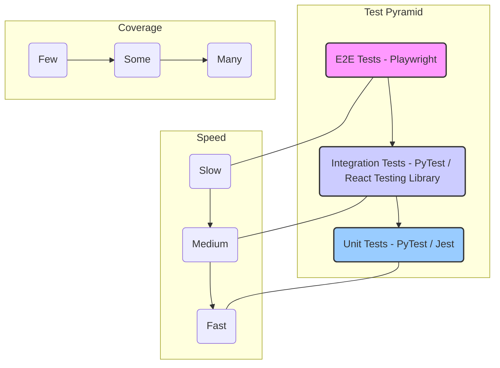

Of course. As a Senior Quality Assurance Architect, here is the comprehensive Phase 6 QA & Test Plan for the "Dominant Digital Empire" (DDE) platform.

***

# Dominant Digital Empire (DDE) - Phase 6: QA & Test Plan

## Document Overview

**Project:** Dominant Digital Empire (DDE)
**Phase:** 6 - Quality Assurance and Testing
**Version:** 1.0
**Date:** October 26, 2023
**Author:** AI Senior Quality Assurance Architect

### 1. Introduction

This document outlines the comprehensive quality assurance strategy and testing plan for the Dominant Digital Empire (DDE) platform. The primary objective of this plan is to ensure the delivery of a high-quality, reliable, secure, and scalable multi-tenant SaaS application.

The QA process will validate that all functional and non-functional requirements specified in the project plan are met. This includes verifying the integrity of the multi-tenant architecture, the functionality of all core modules (Website Builder, CRM, Marketing, etc.), the robustness of the containerized infrastructure, and the security of the entire system.

Our quality goals are centered around:
*   **Reliability:** Ensuring system stability and uptime.
*   **Functionality:** Verifying that all features work as designed.
*   **Scalability:** Confirming the system can handle growth in tenants, clients, and traffic.
*   **Security:** Protecting tenant and client data through rigorous testing.
*   **Usability:** Providing an intuitive and efficient user experience for all roles (Admin, Agency, Client).
*   **Performance:** Guaranteeing fast response times and efficient resource utilization.

---

## 2. Test Strategy

Our test strategy employs a multi-layered approach, combining manual and automated testing methodologies to achieve comprehensive coverage. This is structured around the "Test Pyramid" model to maximize efficiency and effectiveness.

### 2.1. Test Pyramid

The DDE testing strategy is built on the principle of the test pyramid, which prioritizes different test types at various levels of the application stack.

*   **Unit Tests (Foundation):** The largest volume of tests. They are fast, isolated, and cheap to maintain.
    *   **Backend (FastAPI):** `PyTest` will be used to test individual functions, services, data models, and utility classes in isolation.
    *   **Frontend (Next.js):** `Jest` and `React Testing Library` will be used to test individual components, hooks, and state management logic.
*   **Integration Tests (Middle Layer):** These tests verify interactions between different parts of the system.
    *   **Backend:** Testing API endpoints, their connection to service layers, and database interactions. This includes validating data flow through the system and communication via the event bus (Redis).
    *   **Frontend:** Testing how multiple components render and interact on a single page or within a complex user flow (e.g., a multi-step form).
*   **End-to-End (E2E) Tests (Peak):** The smallest volume of tests. They simulate real user journeys from the browser to the database and back.
    *   **Tool:** `Playwright` will be used for its robustness, speed, and cross-browser capabilities.
    *   **Scope:** Covers critical business flows like agency onboarding, client website deployment, and subscription billing.

### 2.2. Manual Testing Strategy

While automation is key, manual testing remains crucial for areas where human intuition and observation are superior.

*   **Exploratory Testing:** Unscripted testing performed by QA engineers to discover defects and edge cases not covered by automated or scripted tests. This will be conducted after major feature releases.
*   **Usability Testing:** Evaluating the user-friendliness of the Admin, Agency, and Client dashboards. This involves assessing the intuitiveness of workflows, clarity of UI elements (shadcn/ui), and overall user experience.
*   **Accessibility Testing (WCAG 2.1 AA):** Manual checks using screen readers and accessibility browser extensions to ensure the platform is usable by people with disabilities.
*   **User Acceptance Testing (UAT):** The final phase of testing where key stakeholders or a select group of beta-test agencies validate that the system meets business requirements before a production launch.

### 2.3. Automated Testing Plan

Automation is the backbone of our CI/CD pipeline and regression strategy.

*   **API Testing:** Automated tests for the FastAPI backend will be written using `PyTest`. Every endpoint will have tests covering successful responses (2xx), client errors (4xx), and server errors (5xx), including authentication and authorization checks.
*   **E2E Testing:** `Playwright` scripts will automate critical user journeys. These tests will run in a headless browser within the CI/CD pipeline against a staging environment.
*   **Visual Regression Testing:** Tools like `Percy` or `Applitools` will be integrated with `Playwright` to catch unintended UI changes by comparing screenshots of key pages against a baseline.

### 2.4. Performance & Load Testing

Ensuring the DDE platform can handle scale is a critical non-functional requirement.

*   **Tools:** `Locust` (Python-based) will be used for its ease of integration with our backend stack. `Prometheus` and `Grafana` will be used for monitoring system metrics during tests.
*   **Test Scenarios:**
    *   **Stress Test:** Determine the maximum capacity of the system by gradually increasing the load until performance degrades.
    *   **Load Test:** Simulate expected production load (e.g., 500 concurrent agencies, 5000 concurrent client users) to measure response times and resource usage.
    *   **Spike Test:** Simulate sudden surges in traffic, such as during a coordinated marketing campaign by multiple agencies.
    *   **Soak Test:** Run a sustained, moderate load over an extended period (e.g., 24 hours) to identify memory leaks or performance degradation over time.
*   **Key Metrics:** Response Time (p95, p99), Error Rate, CPU/Memory Utilization, Database Query Performance.

---

## 3. Test Cases

This section provides representative examples of test cases across different categories. A full test case repository will be maintained in a Test Management tool (e.g., TestRail, Zephyr).

### 3.1. Critical Path Scenarios (Happy Path)

| ID     | Module               | Test Case Description                                                                                                                              | Expected Result                                                                                                                                     |
| :----- | :------------------- | :------------------------------------------------------------------------------------------------------------------------------------------------- | :-------------------------------------------------------------------------------------------------------------------------------------------------- |
| **DDE-TC-001** | Onboarding & Billing | An agency user signs up for a "Pro" plan, enters valid Stripe payment details, and successfully creates their agency tenant.                | The user is billed correctly, their tenant is created with Pro features, and they are redirected to their new Agency Dashboard.                     |
| **DDE-TC-002** | Client & Site Deploy | The agency onboards a new client via the form. The AI agent autonomously builds and deploys the client's website in a new Docker container. | A new sub-tenant is created. A website is deployed to a unique URL with automatic SSL. The client receives login credentials for their control panel. |
| **DDE-TC-003** | AI Content Studio    | An agency user uses the AI Blog Writer to generate a 1000-word article, edits it in the WYSIWYG editor, and publishes it to a client's blog. | The article is generated, saved, and appears live on the client's public-facing blog. The sitemap is updated.                                    |
| **DDE-TC-004** | CRM & Automation     | A lead submits a form on a client's website. A CRM contact is created, and an email automation sequence is triggered.                         | The contact appears in the CRM. The lead receives the first email in the sequence via SendGrid.                                                     |

### 3.2. Edge Cases & Negative Tests

| ID     | Module         | Test Case Description                                                                                               | Expected Result                                                                                             |
| :----- | :------------- | :------------------------------------------------------------------------------------------------------------------ | :---------------------------------------------------------------------------------------------------------- |
| **DDE-TC-051** | Multi-Tenancy  | Using a valid JWT for Agency A, attempt to access an API endpoint for Agency B's data (e.g., `/api/v1/crm/contacts?tenant_id=B`). | The API returns a `403 Forbidden` or `404 Not Found` error. No data from Agency B is exposed.               |
| **DDE-TC-052** | RBAC           | A user with a "Client" role attempts to access the Agency-level "Billing" page via direct URL navigation.         | The user is redirected away from the page and shown an "Access Denied" message.                             |
| **DDE-TC-053** | API Validation | Send a POST request to `/api/v1/blogs` with a missing `title` field in the JSON payload.                        | The API returns a `422 Unprocessable Entity` error with a clear message indicating the `title` field is required. |
| **DDE-TC-054** | Concurrency    | Two users from the same agency attempt to edit and save the same CRM contact record simultaneously.             | The system handles the conflict gracefully, either through optimistic locking (first save wins) or by notifying the second user of the conflict. Data corruption does not occur. |

### 3.3. Security Test Cases

| ID     | Category       | Test Case Description                                                                                                                            | Expected Result                                                                                                                                    |
| :----- | :------------- | :----------------------------------------------------------------------------------------------------------------------------------------------- | :------------------------------------------------------------------------------------------------------------------------------------------------- |
| **DDE-SEC-001** | SQL Injection  | Submit a form (e.g., login, contact form) with a SQL injection payload like `' OR '1'='1` in an input field.                               | The input is properly sanitized. The application logic rejects the input, and no unintended database query is executed. The application remains stable. |
| **DDE-SEC-002** | XSS            | Enter a `` payload into a field that is rendered on a dashboard (e.g., a blog comment, a CRM note).           | The output is properly encoded on the page (e.g., displays as text). The JavaScript does not execute in the browser.                                    |
| **DDE-SEC-003** | Broken Access  | A logged-in client user attempts to access another client's resources by guessing object IDs in the URL (e.g., `/client/assets/123` -> `/client/assets/124`). | The system returns a `403 Forbidden` error. The authorization layer correctly enforces that a user can only access resources within their `sub_tenant_id`. |
| **DDE-SEC-004** | JWT Validation | Attempt to use an expired or tampered JWT to access a protected API endpoint.                                                          | The API gateway or auth middleware rejects the request with a `401 Unauthorized` error.                                                            |

---

## 4. QA Workflow

### 4.1. CI/CD Integration

Our QA process is deeply embedded into the CI/CD pipeline (e.g., GitHub Actions, GitLab CI) to provide rapid feedback.

**Pull Request (PR) Workflow:**
1.  **Code Push:** A developer pushes code to a feature branch.
2.  **PR Creation:** A PR is created targeting the `develop` branch.
3.  **CI Pipeline Trigger:** The following jobs run automatically:
    *   **Lint & Static Analysis:** Run `ruff` (Python) and `ESLint` (Next.js).
    *   **Unit & Integration Tests:** Execute `pytest` and `jest` suites.
    *   **Build:** Build backend and frontend Docker images.
    *   **Security Scan:** Run `Snyk` or `Dependabot` to check for vulnerable dependencies.
    *   **Deploy to Preview:** Deploy the built images to a temporary, isolated preview environment.
    *   **E2E Tests:** Run the `Playwright` suite against the preview environment.
4.  **PR Review:** The PR is blocked from merging if any CI step fails. A QA engineer and a peer developer review the code and test results.
5.  **Merge:** Upon approval, the PR is merged into `develop`.

### 4.2. Bug Tracking Workflow

We will use **Jira** for bug tracking and management.

**Bug Lifecycle:**
*   **New:** A bug is reported by a team member or user.
*   **In Triage:** The QA lead and Product Manager review the bug, assign Severity and Priority, and assign it to the appropriate development sprint.
*   **To Do:** The bug is ready to be worked on by a developer.
*   **In Progress:** A developer is actively working on a fix.
*   **In Review:** The fix is complete and is undergoing code review.
*   **Ready for QA:** The fix has been merged and deployed to the `staging` environment.
*   **In QA:** A QA engineer is actively verifying the fix.
*   **Done:** The fix is verified and the ticket is closed.
*   **Reopened:** The fix is not working as expected, and the ticket is sent back to the developer with comments.

**Severity Levels:**
*   **Blocker:** Prevents core functionality; no workaround exists.
*   **Critical:** Major feature failure, data loss, or security vulnerability.
*   **Major:** Significant feature failure but a workaround exists.
*   **Minor:** Minor feature issue or UI/UX problem.
*   **Trivial:** Cosmetic issue like a typo or alignment problem.

### 4.3. Release Validation Checklist

Before any deployment to the production environment, the following checklist must be completed and signed off by the QA Lead.

- [ ] All features planned for the release are code-complete and merged to the release candidate branch.
- [ ] The full automated regression suite (Unit, Integration, E2E) has passed with a 100% success rate on the `staging` environment.
- [ ] Manual regression testing for areas not covered by automation is complete.
- [ ] All `Blocker` and `Critical` bugs discovered during the release cycle have been fixed and verified.
- [ ] Performance and load tests show no performance degradation compared to the previous release.
- [ ] All necessary database migrations have been tested.
- [ ] The rollback plan for this release has been documented and tested.
- [ ] All relevant documentation (API docs, user guides) has been updated.
- [ ] Final sign-off from the Product Owner and Head of Engineering has been obtained.

---

## 5. Acceptance Test Plan

### 5.1. Release Criteria

These criteria define the conditions for a Go/No-Go decision for a production release.

**Entry Criteria (Ready for QA):**
*   The build has been successfully deployed to the `staging` environment.
*   All unit and integration tests passed in the CI pipeline for the build.
*   A release candidate branch has been created.
*   Release notes detailing new features and bug fixes are available.

**Exit Criteria (Ready for Production):**
*   100% of critical path test cases have passed.
*   Zero open `Blocker` or `Critical` severity bugs.
*   The number of open `Major` severity bugs is within the threshold agreed upon by stakeholders (e.g., < 5).
*   The automated E2E test suite pass rate is >= 99%.
*   Performance metrics (response time, error rate) are within acceptable limits.
*   The Release Validation Checklist is complete and signed off.

### 5.2. Regression Testing Strategy

Regression testing is vital to ensure that new code changes do not break existing functionality.

*   **Smoke Testing:** A small, automated suite of ~10-15 E2E tests covering the absolute most critical functions (e.g., login, dashboard loading, new user signup). This runs immediately after every deployment to any environment to provide a quick health check.
*   **Automated Regression:** The full suite of E2E and integration tests. This is run nightly on the `develop` branch and on-demand for any release candidate branch.
*   **Manual Regression:** Prior to major releases, QA engineers will execute a checklist of manual test cases for complex workflows, UI/UX consistency, and areas with low automated test coverage.
*   **Feature-Specific Regression:** When a bug is fixed, the QA engineer will test the surrounding functionality to ensure the fix did not cause any regressions in related features. All new features must be accompanied by new regression tests.